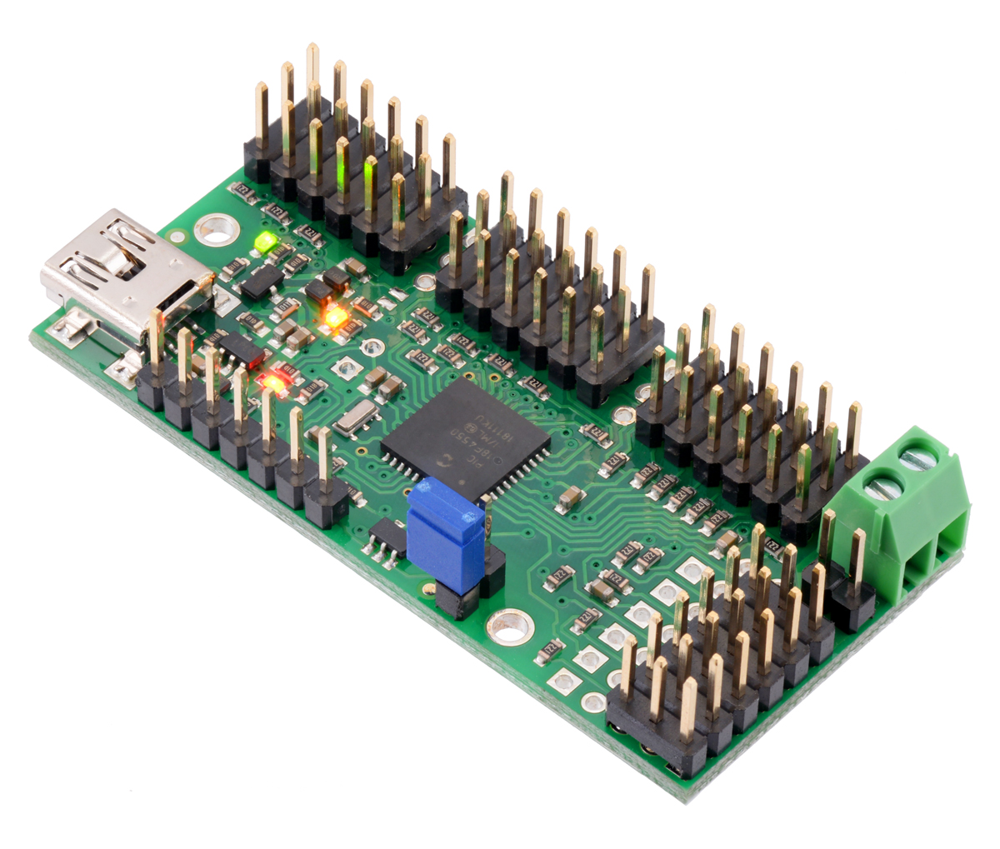
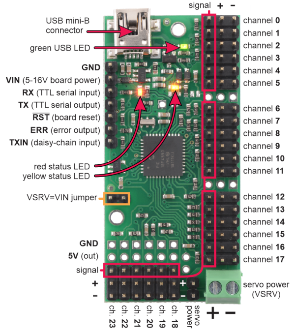
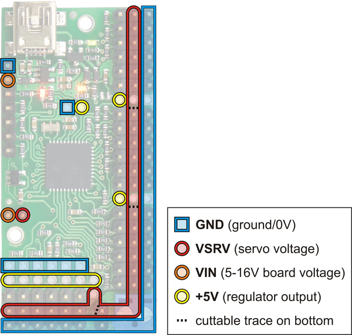
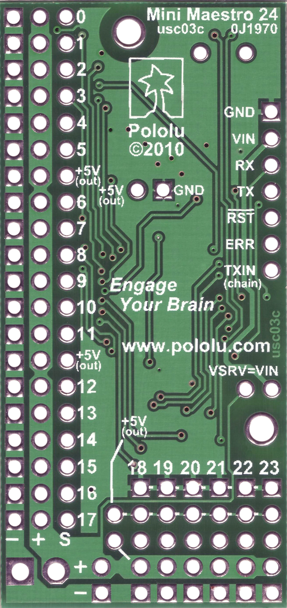

Pololu Maestro USB Servo Controller Linux Software

Release Date: 2024-08-14
http://www.pololu.com/


This binary release contains the Maestro Control Center
(MaestroControlCenter) and the Maestro command-line utility
(UscCmd).  These programs allow you to configure and control the
Maestro over USB.

# Hexapod
## Documentation

[Pololu - Mini Maestro 24-Channel USB Servo Controller (Assembled)](https://www.pololu.com/product/1356)

[Pololu Maestro Servo Controller User’s Guide](https://www.pololu.com/docs/0J40)




## Pinout



### Power lines



### Bottom:



## Installation

Turn off system UART but enable UART hardware-> this enables to use UART for external microcontrollers

```
sudo raspi-config
```
Interfaces -> UART -> disable system -> enable hardware -> reboot

```
pip install pyserial
```

In Arch Linux:
  ```
  sudo pacman -S libusb mono
  ```

## Motor values while assembling
- **motor k+0 - 1500 - mid**
- **motor k+1 - min**
- **motor k+2 - max**


# Vanilla

== Prerequisites ==

You will need to download and install these packages:

  libusb-1.0-0-dev mono-runtime libmono-system-windows-forms4.0-cil

In Ubuntu, you can do this with the command:

  sudo apt-get install libusb-1.0-0-dev mono-runtime libmono-system-windows-forms4.0-cil

== USB Configuration ==

You will need to copy the file 99-pololu.rules to /etc/udev/rules.d/
in order to grant permission for all users to use Pololu USB devices.
Then, run

  sudo udevadm control --reload-rules

to make sure the rules get reloaded.  If you already plugged in
a Pololu USB device, you should unplug it at this point so the new
permissions will get applied later when you plug it back in.


== Running the programs ==

You can run the programs by typing one of the following commands:

   ./MaestroControlCenter
   ./UscCmd

If you get an error message that says "cannot execute binary file",
then try running the program with the mono command, for example:

   mono ./UscCmd


== Source Code ==

The C# source code for UscCmd is available in the Pololu USB Software
Development Kit, available at:

  http://www.pololu.com/docs/0J41
